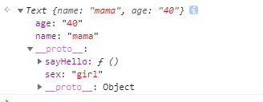
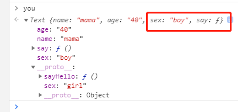

##### 1、Object.defineProperty
- Object.defineProperty(obj,prop,descriptior)
1、obj:需要定义的属性对象
2、prop:需要定义（创建）或修改的属性的名字
3、descriptor:需要定义或修改的属性的描述符，可以是一个对象
```
var person = {

}
Object.defineProperty(persion,"age",{
	configurable:true,//可以修改默认属性
	enumerable:true,//可以被枚举
	writable:true,//可以修改这个属性的值
	value:1//定义一个初始值为1
})
```
现在我们来修改一下默认的值
```
Object.defineProperty(person,'age',{
	configurable:true,   //	configurable:false, 不允许修改默认属性了,就算再回改回来也报错。
	enumerable:false,
	writable:false,
	value:1
})
console.log(person)  //Object {age:1}
person.age = 2;
console.log(person)  //Object {age:1},因为writable设为了false,所以不可以写，严格模式下会报错
for(var k in person){
	console.log(k)  //不起作用,因为enumerable的值被设置为false了
}
```
- 访问器属性
1、get在读取属性时调用的函数，默认值为undefined
2、set在设置属性时调用的函数，默认值为undefined
3、访问器属性不能直接定义，只能通过`Object.defineProperty`来定义
```
var person = {
	age:1
}
Object.defineProperty(person,'age',{
	get(){
		return 3
	},
	set(val){
		console.log(val)
	}
})
person.age// 3,我们明明写的是a:1,怎么返回的3呢?这就是get()的威力了
person.a = 5// 5,相应的设置的时候执行了set()函数
```
模拟一个访问和设置的默认行为
**举例说明Object.defineProperty什么情况下会造成循环引用导致栈溢出**
```
var person = {
	age:1
}
Object.defineProperty(person,'age',{
	get(){
		return this.age
	},
	set(val){
		this.age = val
	}
})

person.age   报错：Maximum call stack size exceeded，循环引用导致栈溢出

person.age --> get.call(person) -->this.age --> person.age --> get.call(person) --> this.age --> .......
```
**解释原型，原型链**
javascript的每个对象都继承另一个父级对象，父级对象称为原型（prototype).
原型（prototype)也是一个对象，原型对象上的所有属性和方法，都能被子对象共享，通过构造函数生成实例对象时，会自动为实例对象分配原型对象，而每一个构造函都有一个prototype属性。这个属性就是实例对象的原型对象。

- 构造函数，实例对象与继承
···
function Text(){
	this.name = "mama"
	this.age = "40"
};

Text.prototype = {
	sex:'girl',
	sayHello:function(){
		console.log(this.sex)
    }
}

var you = new Text();
···
console.log(you)

- 可以看出you就是一个实例对象， Text是一个构造函数，you实例继承了Text的原型对象`（prototype）`,you需要通过`__proto__`连接Text的原型特征：
同时，you也可以设置自己的属性和方法：
···
you.sex = 'boy'
you.say = function(){
	console.log('我会说你好呀')
}
···

- 原型对象
原型对象就是一个对象，它包含着所有实例对象需要共享的属性和方法。
原型对象都包含一个`constructor`的属性，它们都指向了自己的构造函数。
即：`Function.prototype.constructor === Function  //true`、`Array.prototype.constructor === Array   //true`、`Object.prototype.constructor === Object //true`
> 所以说，构造函数里的prototype是它的原型对象，而原型对象里有一个constructor的属性，指向构造函数。？？？

- `__proto__`
`Function.prototype.__proto__ === Object.prototype    //true`
`Array.prototype.__proto__ === Object.prototype			//true`
`Function.prototype.__proto__ === Array.prototype.__proto__  //true`

https://zhuanlan.zhihu.com/p/47513635